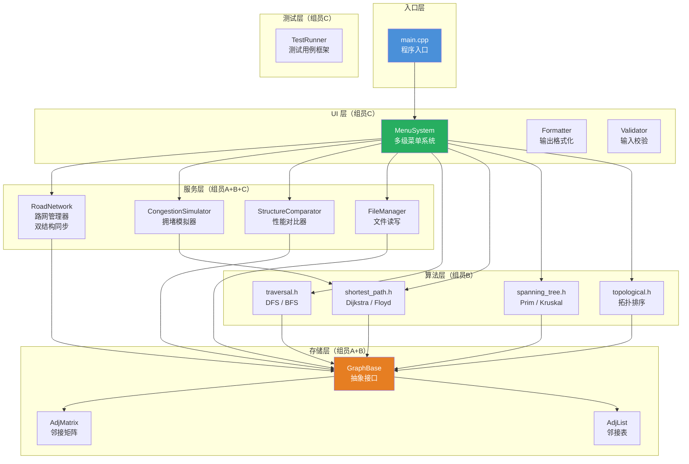
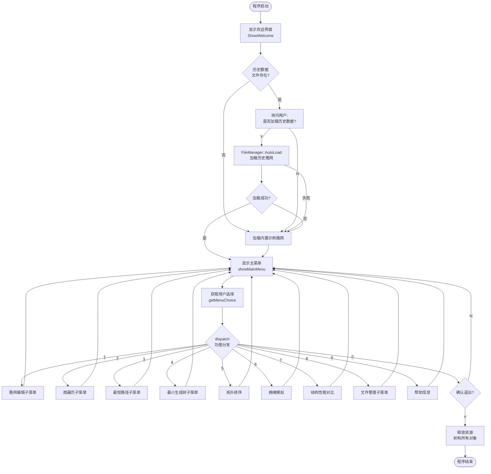
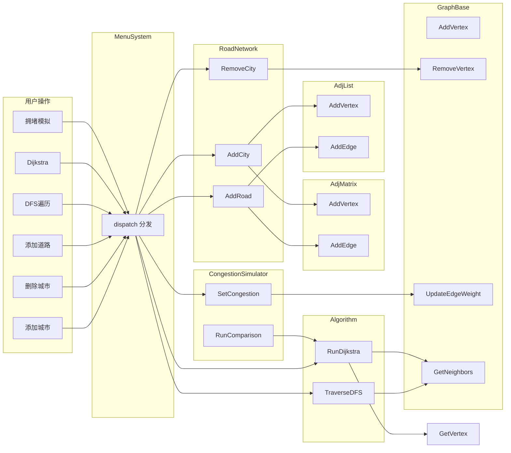
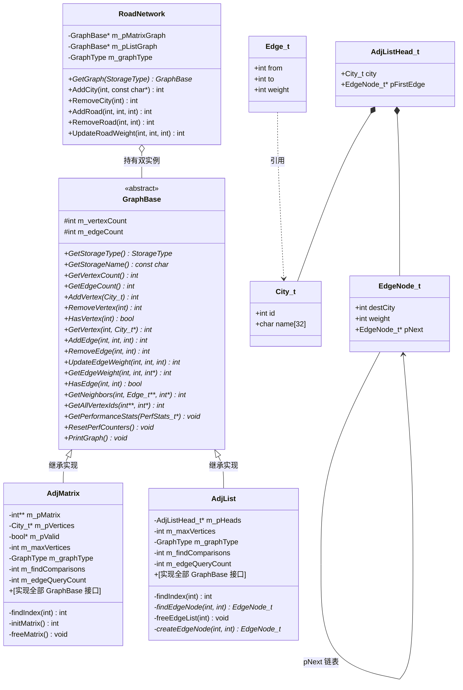
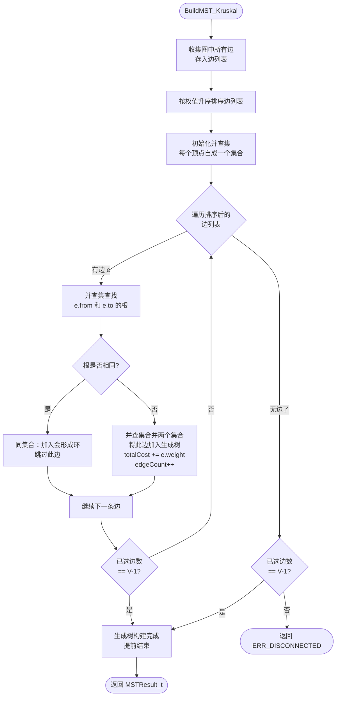
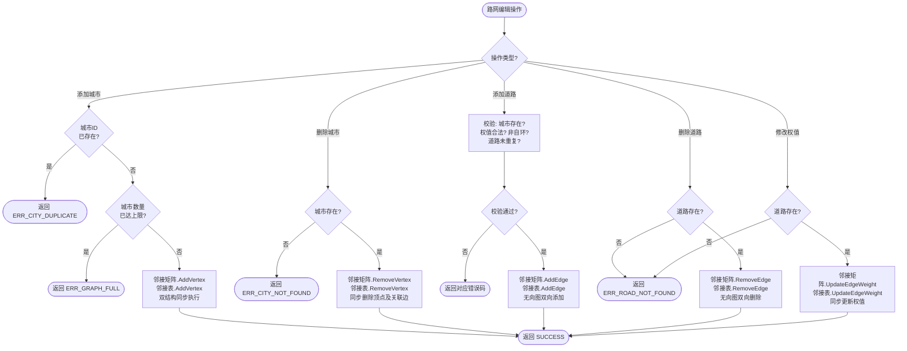
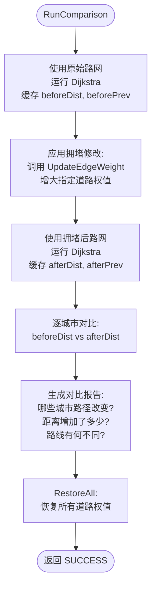

# 城市交通路网分析系统——流程图集

> 绘制人：组员A（架构负责人）
>
> 本文件包含系统全部核心流程图，使用 Mermaid 语法绘制，可在 VSCode 中安装 Mermaid 插件预览。

---

## 一、系统整体架构图



---

## 二、程序主流程图



---

## 三、模块调用关系图



---

## 四、图存储结构类图



---

## 五、DFS 深度优先遍历流程图

```mermaid
flowchart TD
    DFS_START([TraverseDFS]) --> INIT[分配 visited 数组<br/>初始化为 false]
    INIT --> PUSH[将起点压入栈]
    PUSH --> LOOP{栈是否为空?}

    LOOP -->|否| POP[弹出栈顶顶点 v]
    POP --> CHECK_VIS{visited[v]<br/>== false?}

    CHECK_VIS -->|是| MARK[标记 visited[v] = true<br/>v 加入遍历序列]
    CHECK_VIS -->|否| LOOP

    MARK --> GET_NEI[获取 v 的所有邻接顶点<br/>GetNeighbors]

    GET_NEI --> NEI_LOOP{遍历邻接顶点}

    NEI_LOOP -->|有未访问邻接点 w| PUSH_W[将 w 压入栈]
    PUSH_W --> NEI_LOOP
    NEI_LOOP -->|遍历完毕| LOOP

    LOOP -->|是| CHECK_ALL{所有顶点<br/>都已访问?}

    CHECK_ALL -->|否| FIND_UNVIS[找到任意未访问顶点<br/>压入栈<br/>（处理非连通图）]
    FIND_UNVIS --> LOOP

    CHECK_ALL -->|是| DFS_RET[释放临时内存<br/>返回遍历序列]
    DFS_RET --> DFS_END([返回 SUCCESS])
```

---

## 六、BFS 广度优先遍历流程图

```mermaid
flowchart TD
    BFS_START([TraverseBFS]) --> INIT[分配 visited 数组<br/>初始化队列]
    INIT --> ENQ_START[起点入队<br/>标记 visited]
    ENQ_START --> LOOP{队列是否为空?}

    LOOP -->|否| DEQ[队首顶点 v 出队]
    DEQ --> ADD_SEQ[v 加入遍历序列]

    ADD_SEQ --> GET_NEI[获取 v 的所有邻接顶点<br/>GetNeighbors]

    GET_NEI --> NEI_LOOP{遍历邻接顶点 w}

    NEI_LOOP -->|有邻接点| CHECK_VIS{visited[w]<br/>== false?}
    CHECK_VIS -->|是| ENQ_W[w 入队<br/>标记 visited[w] = true]
    CHECK_VIS -->|否| NEI_LOOP
    ENQ_W --> NEI_LOOP

    NEI_LOOP -->|遍历完毕| LOOP

    LOOP -->|是| CHECK_ALL{所有顶点<br/>都已访问?}
    CHECK_ALL -->|否| FIND_UNVIS[找未访问顶点入队<br/>（非连通图处理）]
    FIND_UNVIS --> LOOP

    CHECK_ALL -->|是| BFS_RET[释放队列和临时内存<br/>返回遍历序列]
    BFS_RET --> BFS_END([返回 SUCCESS])
```

---

## 七、Dijkstra 最短路径流程图

```mermaid
flowchart TD
    DIJ_START([RunDijkstra]) --> INIT[初始化 dist 数组 = INF<br/>初始化 prev 数组 = -1<br/>初始化 visited 数组 = false]
    INIT --> SET_START[dist[start] = 0]

    SET_START --> MAIN_LOOP{已确定顶点数<br/>< 总顶点数?}

    MAIN_LOOP -->|是| FIND_MIN[从未确定顶点中<br/>选取 dist 最小的顶点 u]

    FIND_MIN --> CHECK_REACH{minDist<br/>== INF?}
    CHECK_REACH -->|是| BREAK[剩余顶点不可达<br/>跳出循环]
    CHECK_REACH -->|否| MARK_U[visited[u] = true<br/>确定 u 的最短路径]

    MARK_U --> GET_NEI[获取 u 的所有邻接顶点<br/>GetNeighbors]

    GET_NEI --> NEI_LOOP{遍历邻接顶点 v}

    NEI_LOOP -->|有邻接点| CHECK_VIS{visited[v]<br/>== false?}
    CHECK_VIS -->|否| NEI_LOOP
    CHECK_VIS -->|是| RELAX{ dist[u] + weight<br/>< dist[v] ?}

    RELAX -->|是| UPDATE[dist[v] = dist[u] + weight<br/>prev[v] = u<br/>松弛操作]
    RELAX -->|否| NEI_LOOP
    UPDATE --> NEI_LOOP

    NEI_LOOP -->|遍历完毕| MAIN_LOOP

    MAIN_LOOP -->|否/break| DIJ_RET[释放临时内存<br/>返回 dist, prev 数组]
    BREAK --> MAIN_LOOP
    DIJ_RET --> DIJ_END([返回 SUCCESS])
```

---

## 八、Floyd 多源最短路径流程图

```mermaid
flowchart TD
    FLOYD_START([RunFloyd]) --> GET_VERTICES[获取所有顶点编号<br/>顶点数 = V]

    GET_VERTICES --> INIT_MAT[分配 V×V 距离矩阵 dist<br/>分配 V×V 路径矩阵 next]

    INIT_MAT --> FILL_MAT[填充初始矩阵:<br/>dist[i][j] = 边权值 or INF<br/>next[i][j] = j or -1]

    FILL_MAT --> K_LOOP{k = 0 to V-1}

    K_LOOP -->|k < V| I_LOOP{i = 0 to V-1}

    I_LOOP -->|i < V| J_LOOP{j = 0 to V-1}

    J_LOOP -->|j < V| CHECK{ dist[i][k] + dist[k][j]<br/>< dist[i][j] ?}

    CHECK -->|是| UPDATE[dist[i][j] = dist[i][k] + dist[k][j]<br/>next[i][j] = next[i][k]<br/>以 k 为中转点更优]
    CHECK -->|否| J_NEXT[j++]
    UPDATE --> J_NEXT

    J_NEXT --> J_LOOP
    J_LOOP -->|j == V| I_NEXT[i++]
    I_NEXT --> I_LOOP
    I_LOOP -->|i == V| K_NEXT[k++]
    K_NEXT --> K_LOOP

    K_LOOP -->|k == V| FLOYD_RET[返回 dist, next 矩阵]
    FLOYD_RET --> FLOYD_END([返回 SUCCESS])
```

---

## 九、Prim 最小生成树流程图

```mermaid
flowchart TD
    PRIM_START([BuildMST_Prim]) --> CHECK_CONN{图是否连通?}
    CHECK_CONN -->|否| PRIM_ERR([返回 ERR_DISCONNECTED])

    CHECK_CONN -->|是| INIT[初始化 key 数组 = INF<br/>初始化 parent 数组 = -1<br/>初始化 inMST 数组 = false]
    INIT --> SET_FIRST[key[0] = 0<br/>从顶点 0 开始]

    SET_FIRST --> MAIN_LOOP{已选顶点数<br/>< 总顶点数?}

    MAIN_LOOP -->|是| FIND_MIN[从 inMST=false 的顶点中<br/>选取 key 最小的顶点 u]

    FIND_MIN --> MARK[inMST[u] = true<br/>u 加入生成树]

    MARK --> GET_NEI[获取 u 的所有邻接顶点]

    GET_NEI --> NEI_LOOP{遍历邻接顶点 v}

    NEI_LOOP -->|有邻接点| CHECK{ inMST[v]==false<br/>且 weight < key[v] ?}

    CHECK -->|是| UPDATE[key[v] = weight<br/>parent[v] = u]
    CHECK -->|否| NEI_LOOP
    UPDATE --> NEI_LOOP

    NEI_LOOP -->|完毕| MAIN_LOOP

    MAIN_LOOP -->|否| BUILD[根据 parent 数组<br/>构建生成树边集合<br/>累计总造价]

    BUILD --> PRIM_RET([返回 MSTResult_t])
```

---

## 十、Kruskal 最小生成树流程图



---

## 十一、拓扑排序流程图（Kahn 算法）

```mermaid
flowchart TD
    TOPO_START([RunTopologicalSort]) --> CHECK_TYPE{图类型<br/>是否为有向图?}
    CHECK_TYPE -->|否| TOPO_ERR([返回错误:<br/>无向图不支持拓扑排序])

    CHECK_TYPE -->|是| INIT[计算所有顶点的入度<br/>分配入度表数组]
    INIT --> INIT_Q[初始化队列<br/>将所有入度=0的顶点入队]

    INIT_Q --> LOOP{队列是否为空?}

    LOOP -->|否| DEQ[队首顶点 v 出队<br/>v 加入拓扑序列<br/>seqLen++]

    DEQ --> GET_NEI[获取 v 的所有邻接顶点]

    GET_NEI --> NEI_LOOP{遍历邻接顶点 w}

    NEI_LOOP -->|有邻接点| DEC_IN[入度[w]--]
    DEC_IN --> CHECK_ZERO{入度[w]<br/>== 0?}
    CHECK_ZERO -->|是| ENQ[w 入队]
    CHECK_ZERO -->|否| NEI_LOOP
    ENQ --> NEI_LOOP

    NEI_LOOP -->|完毕| LOOP

    LOOP -->|是| CHECK_ALL{seqLen<br/>== 总顶点数?}

    CHECK_ALL -->|是| NO_CYCLE[hasCycle = false<br/>拓扑排序成功]
    CHECK_ALL -->|否| HAS_CYCLE[hasCycle = true<br/>存在环路<br/>无法完全拓扑排序]

    NO_CYCLE --> TOPO_RET([返回结果])
    HAS_CYCLE --> TOPO_RET
```

---

## 十二、路网编辑流程图（双结构同步）



---

## 十三、拥堵模拟对比流程图



---

## 十四、文件 IO 流程图

```mermaid
flowchart TD
    subgraph 保存流程
        SAVE_START([SaveToFile]) --> S_OPEN[以写模式打开文件]
        S_OPEN --> S_CHECK{打开成功?}
        S_CHECK -->|否| S_ERR([返回 ERR_FILE_OPEN_FAIL])
        S_CHECK -->|是| S_HEADER[写入文件头:<br/>图类型 城市数 道路数]
        S_HEADER --> S_CITIES[遍历所有城市顶点<br/>逐行写入: ID 名称]
        S_CITIES --> S_EDGES[遍历所有边<br/>逐行写入: 起点 终点 权值]
        S_EDGES --> S_CLOSE[关闭文件]
        S_CLOSE --> S_OK([返回 SUCCESS])
    end

    subgraph 加载流程
        LOAD_START([LoadFromFile]) --> L_OPEN[以读模式打开文件]
        L_OPEN --> L_CHECK{打开成功?}
        L_CHECK -->|否| L_ERR([返回 ERR_FILE_OPEN_FAIL])
        L_CHECK -->|是| L_HEADER[读取文件头:<br/>图类型 城市数 道路数]
        L_HEADER --> L_FMT{格式校验}
        L_FMT -->|不合法| L_FMT_ERR([返回 ERR_FILE_FORMAT])
        L_FMT -->|合法| L_CLEAR[清空当前图数据]
        L_CLEAR --> L_LOOP_CITY{读取城市行}
        L_LOOP_CITY -->|有数据| L_ADD_CITY[解析行 → AddVertex]
        L_ADD_CITY --> L_LOOP_CITY
        L_LOOP_CITY -->|城市读完| L_LOOP_EDGE{读取道路行}
        L_LOOP_EDGE -->|有数据| L_ADD_EDGE[解析行 → AddEdge]
        L_ADD_EDGE --> L_LOOP_EDGE
        L_LOOP_EDGE -->|道路读完| L_CLOSE[关闭文件]
        L_CLOSE --> L_OK([返回 SUCCESS])
    end
```



---

## 十五、结构性能对比流程图

```mermaid
flowchart TD
    CMP_START([RunFullComparison]) --> TITLE[打印对比报告标题]

    TITLE --> MEM[1. 内存占用对比]
    MEM --> MEM_M[计算邻接矩阵内存:<br/>sizeof矩阵 + 顶点数组]
    MEM_M --> MEM_L[计算邻接表内存:<br/>sizeof头数组 + 边结点]

    MEM_L --> TRAV[2. 遍历速度对比]
    TRAV --> TRAV_M[邻接矩阵: 计时运行<br/>DFS + BFS 全顶点]
    TRAV_M --> TRAV_L[邻接表: 计时运行<br/>DFS + BFS 全顶点]

    TRAV_L --> FIND[3. 顶点查找效率]
    FIND --> FIND_M[邻接矩阵: 统计<br/>遍历比较次数]
    FIND_M --> FIND_L[邻接表: 统计<br/>遍历比较次数]

    FIND_L --> EDGE_Q[4. 边查询效率]
    EDGE_Q --> EDGE_M[邻接矩阵: O(1) 直接访问<br/>统计查询次数]
    EDGE_M --> EDGE_L[邻接表: 遍历链表查找<br/>统计比较次数]

    EDGE_L --> TABLE[汇总生成对比表格]
    TABLE --> CONCLUSION[输出结论:<br/>稠密图推荐矩阵<br/>稀疏图推荐邻接表]
    CONCLUSION --> CMP_END([结束])
```

---

## 附：文件清单对应关系

| 流程图编号 | 对应源文件 | 负责组员 |
|-----------|-----------|---------|
| 一、系统整体架构 | 全部 | 组员A |
| 二、程序主流程 | `main.cpp`, `ui/menu.h` | 组员A + C |
| 三、模块调用关系 | 全部 `.h` | 组员A |
| 四、数据结构类图 | `graph/*`, `common/types.h` | 组员A + B |
| 五、DFS 遍历 | `algorithms/traversal.h` | 组员B |
| 六、BFS 遍历 | `algorithms/traversal.h` | 组员B |
| 七、Dijkstra | `algorithms/shortest_path.h` | 组员B |
| 八、Floyd | `algorithms/shortest_path.h` | 组员B |
| 九、Prim | `algorithms/spanning_tree.h` | 组员B |
| 十、Kruskal | `algorithms/spanning_tree.h` | 组员B |
| 十一、拓扑排序 | `algorithms/topological.h` | 组员B |
| 十二、路网编辑 | `services/road_network.h`, `graph/*` | 组员A + B |
| 十三、拥堵模拟 | `services/congestion.h` | 组员C |
| 十四、文件 IO | `services/file_io.h` | 组员A + C |
| 十五、性能对比 | `services/comparator.h` | 组员C |
